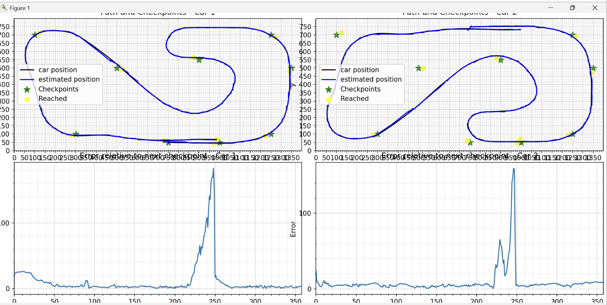

# Probabilistic Reasoning for Autonomous Localization

This project explores probabilistic methods for **localizing an autonomous vehicle in a racetrack environment** and reasoning about competitive racing outcomes under uncertainty. It combines **Particle Filtering**, **Kalman Filtering**, and **Bayesian Networks** to model noisy perception, motion uncertainty, and decision-making.

Course: CMSC 421 – Artificial Intelligence  

---

## Project Overview

The goal was to localize a car in a 2D racetrack environment using noisy sensor data and to analyze overtaking decisions probabilistically.

The project consists of three main components:

1. **Particle Filter** – Nonparametric localization using noisy range sensors  
2. **Kalman Filter** – Parametric state estimation using noisy GPS data  
3. **Bayesian Network** – Probabilistic reasoning about overtaking, crashes, and race outcomes  

---

## Particle Filtering (Localization)

### What I Built
- Implemented a **particle filter** to estimate the car’s position and orientation
- Modeled motion uncertainty and sensor noise
- Performed resampling based on likelihood of sensor readings

### Key Concepts
- Transition model with Gaussian noise
- Likelihood weighting using sensor discrepancies
- Tradeoff between particle count, accuracy, and runtime

### Results
- Successfully localized the vehicle under moderate noise
- Observed degradation with high sensor noise or insufficient particles

📈 Example visualization:

Demo:
- `videos/particle_filter_demo.mp4`

---

## Kalman Filtering (State Estimation)

### What I Built
- Implemented a **Kalman filter** to track position and velocity
- Modeled GPS measurement noise (Gaussian and uniform)
- Integrated collision handling into the state update

### Key Assumptions
- Linear motion model
- Gaussian noise
- Stationary noise statistics

### Results
- Strong performance under Gaussian noise
- Degradation under non-Gaussian noise distributions

Example visualization:

Demo:
- `videos/kalman_filter_demo.mp4`

---

## Bayesian Network (Decision-Making Under Uncertainty)

### What I Built
- Constructed a **Bayesian Network** modeling:
  - Relative speed
  - Timing of overtake
  - Crash likelihood
  - Probability of winning
- Estimated CPTs from empirical data
- Used probabilistic inference to find the **optimal overtaking strategy**

### Key Insight
The highest probability of winning **without crashing** occurs when:
- The car is **much faster**
- The overtake attempt is **early**

This was validated via conditional probability inference.

---

## What This Project Demonstrates

- Practical application of probabilistic AI techniques
- Understanding of uncertainty in real-world systems
- Ability to connect theory (Bayes, filtering) with empirical behavior
- Strong analytical reasoning and experimental evaluation

---

## Tech Stack

- Python
- NumPy
- FilterPy (Kalman Filter)
- AIMA Probability Library
- Matplotlib (visualization)

---

